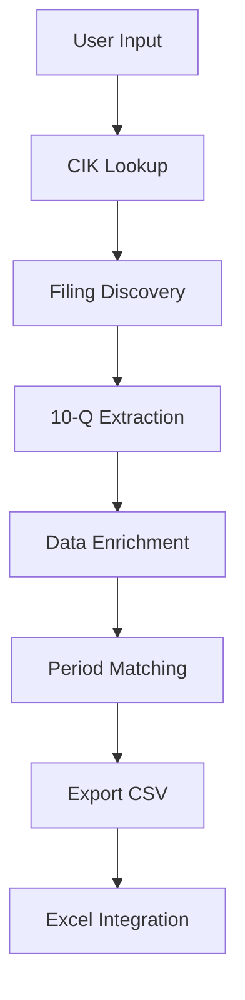
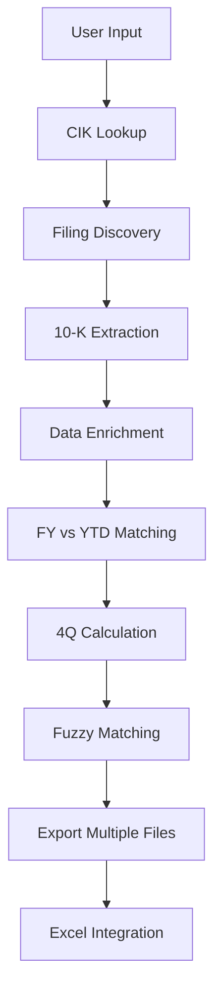

# EDGAR Financial Data Extractor - Technical Architecture

## 🏗️ System Overview

The EDGAR Financial Data Extractor is a multi-component system designed to automate the extraction, processing, and integration of financial data from SEC EDGAR filings. The architecture follows a modular design pattern with clear separation of concerns between data extraction, processing, enrichment, and presentation layers.

## 📊 High-Level Architecture

```
┌─────────────────────────────────────────────────────────────────┐
│                        USER INTERFACE LAYER                     │
├─────────────────────────────────────────────────────────────────┤
│  Excel Workbook (Updater_EDGAR.xlsm)                           │
│  ┌─────────────────┐  ┌─────────────────┐  ┌─────────────────┐ │
│  │   Raw_data      │  │   VBA Macros    │  │   Model Sheets  │ │
│  │   (Input/Output)│  │   (Automation)  │  │   (Analysis)    │ │
│  └─────────────────┘  └─────────────────┘  └─────────────────┘ │
└─────────────────────────────────────────────────────────────────┘
                                │
                                ▼
┌─────────────────────────────────────────────────────────────────┐
│                      INTEGRATION LAYER                          │
├─────────────────────────────────────────────────────────────────┤
│  VBA Modules                                                    │
│  ┌─────────────────┐  ┌─────────────────┐                      │
│  │  GetData.bas    │  │ UpdateModel.bas │                      │
│  │  (Data Retrieval)│  │  (Model Updates)│                      │
│  └─────────────────┘  └─────────────────┘                      │
└─────────────────────────────────────────────────────────────────┘
                                │
                                ▼
┌─────────────────────────────────────────────────────────────────┐
│                      PROCESSING LAYER                           │
├─────────────────────────────────────────────────────────────────┤
│  Python Pipeline                                                │
│  ┌─────────────────┐  ┌─────────────────┐  ┌─────────────────┐ │
│  │ edgar_pipeline  │  │     utils       │  │     enrich      │ │
│  │   (Core Logic)  │  │  (Helpers)      │  │  (Enhancement)  │ │
│  └─────────────────┘  └─────────────────┘  └─────────────────┘ │
└─────────────────────────────────────────────────────────────────┘
                                │
                                ▼
┌─────────────────────────────────────────────────────────────────┐
│                      DATA SOURCE LAYER                          │
├─────────────────────────────────────────────────────────────────┤
│  SEC EDGAR API                                                  │
│  ┌─────────────────┐  ┌─────────────────┐  ┌─────────────────┐ │
│  │   XBRL Data     │  │  Filing Index   │  │  Presentation   │ │
│  │  (Financial)    │  │  (Metadata)     │  │   (.pre.xml)    │ │
│  └─────────────────┘  └─────────────────┘  └─────────────────┘ │
└─────────────────────────────────────────────────────────────────┘
```

## 🔄 Data Flow Architecture

### 1. Data Extraction Flow

```
SEC EDGAR → Filing Discovery → XBRL Parsing → Fact Extraction → Enrichment → Matching → Export
    │              │              │              │              │           │         │
    ▼              ▼              ▼              ▼              ▼           ▼         ▼
  CIK Lookup   Accession List   Context Parse   Tag/Value     Period      Current   CSV/Excel
  (utils.py)   (pipeline.py)    (utils.py)      Extraction    Mapping     vs Prior   Output
```

### 2. Processing Pipeline Stages

#### Stage 1: Filing Discovery
- **Input**: Ticker symbol, year, quarter
- **Process**: CIK lookup → filing index retrieval → filtering by period
- **Output**: List of relevant 10-Q/10-K accessions
- **Key Components**: `lookup_cik_from_ticker()`, `fetch_recent_10q_10k_accessions()`

#### Stage 2: XBRL Extraction
- **Input**: Filing accessions
- **Process**: Download iXBRL files → parse XML → extract facts and contexts
- **Output**: Raw XBRL facts with metadata
- **Key Components**: `extract_facts_with_document_period()`, `extract_dimensions_from_context()`

#### Stage 3: Data Enrichment
- **Input**: Raw XBRL facts
- **Process**: Period categorization → dimensional mapping → presentation role assignment
- **Output**: Enriched facts with business context
- **Key Components**: `enrich_filing()`, `get_concept_roles_from_presentation()`

#### Stage 4: Period Matching
- **Input**: Enriched facts from current and prior periods
- **Process**: Exact matching → fuzzy fallback → quality scoring
- **Output**: Aligned current vs prior period data
- **Key Components**: `zip_match_in_order()`, `run_adaptive_match_keys()`

#### Stage 5: Export & Integration
- **Input**: Matched and processed data
- **Process**: Standardization → CSV export → Excel integration
- **Output**: Analysis-ready datasets
- **Key Components**: `standardize_zip_output()`, export functions

## 🧩 Component Architecture

### 1. Core Processing Engine (`edgar_pipeline.py`)

**Responsibilities**:
- Orchestrates the entire data processing pipeline
- Manages filing discovery and filtering
- Coordinates data extraction and enrichment
- Handles period matching and calculations
- Controls export and integration

**Key Design Patterns**:
- **Pipeline Pattern**: Sequential processing stages
- **Strategy Pattern**: Different matching algorithms
- **Factory Pattern**: Dynamic filing type handling

**Core Functions**:
```python
def run_edgar_pipeline(ticker, year, quarter, full_year_mode, debug_mode, excel_file, sheet_name):
    # Main orchestration function
    # Coordinates all processing stages
    
def extract_facts_with_document_period(ixbrl_url, headers):
    # XBRL fact extraction with period context
    
def enrich_filing(filing):
    # Data enrichment and categorization
```

### 2. Utility Layer (`utils.py`)

**Responsibilities**:
- Provides shared utility functions
- Handles data transformation and standardization
- Implements matching algorithms
- Manages configuration and logging

**Key Functions**:
```python
def lookup_cik_from_ticker(ticker):
    # SEC CIK resolution
    
def extract_dimensions_from_context(context_html):
    # XBRL dimensional data parsing
    
def run_adaptive_match_keys(curr_df, prior_df, match_keys, min_keys):
    # Intelligent data matching
```

### 3. Enrichment Engine (`enrich.py`)

**Responsibilities**:
- Enhances extracted data with presentation context
- Handles negated label detection
- Maps concepts to presentation roles
- Provides business context for financial data

**Key Functions**:
```python
def get_concept_roles_from_presentation(cik, accession_number, headers):
    # Presentation role mapping
    
def get_negated_label_concepts(cik, accession_number, headers):
    # Negated label detection
```

### 4. VBA Integration Layer

**Responsibilities**:
- Provides Excel automation interface
- Handles user input validation
- Manages file downloads and imports
- Coordinates with Python processing pipeline

**Key Modules**:
```vba
' GetData.bas - Data retrieval automation
Public Sub GetData()
    ' Main entry point for Excel integration
    
Private Sub SetupRanges()
    ' Input configuration and validation
    
Private Sub Import_EDGAR_Data()
    ' Data import and integration
```

## 🔧 Technical Design Decisions

### 1. Modular Architecture

**Decision**: Separate concerns into distinct modules
**Rationale**: 
- Enables independent testing and maintenance
- Facilitates code reuse and extension
- Improves debugging and error isolation

**Implementation**:
- Core logic in `edgar_pipeline.py`
- Utilities in `utils.py`
- Enrichment in `enrich.py`
- Configuration in `config.py`

### 2. XBRL-First Approach

**Decision**: Focus on XBRL data extraction over HTML parsing
**Rationale**:
- XBRL provides structured, machine-readable data
- Reduces parsing errors and inconsistencies
- Enables dimensional data extraction
- Supports automated validation

**Implementation**:
- Primary extraction from iXBRL files
- Context-aware fact parsing
- Dimensional metadata preservation

### 3. Adaptive Matching Strategy

**Decision**: Multi-level matching with fallback mechanisms
**Rationale**:
- Handles variations in XBRL reporting
- Provides graceful degradation for complex data
- Ensures maximum data coverage
- Maintains data quality through scoring

**Implementation**:
```python
# Exact matching first
exact_matches = zip_match_in_order(df_curr, df_prior, primary_keys)

# Fuzzy fallback for unmatched data
fuzzy_matches = run_adaptive_match_keys(unmatched_curr, unmatched_prior, 
                                       fallback_keys, min_threshold)
```

### 4. Excel Integration Strategy

**Decision**: VBA-based integration with Python processing
**Rationale**:
- Leverages existing Excel infrastructure
- Provides familiar user interface
- Enables real-time data updates
- Supports complex financial modeling

**Implementation**:
- VBA handles user interaction and file management
- Python handles heavy data processing
- CSV files serve as integration interface

## 📊 Data Models

### 1. XBRL Fact Model

```python
{
    "tag": "us-gaap:Revenues",
    "value": "123456789",
    "contextref": "FD2023Q1",
    "unitref": "USD",
    "decimals": "-6",
    "dimensions": [
        {
            "dimension": "us-gaap:StatementBusinessSegmentsAxis",
            "member": "us-gaap:PlatformDivisionMember"
        }
    ]
}
```

### 2. Enriched Fact Model

```python
{
    "tag": "us-gaap:Revenues",
    "value": "123456789",
    "matched_category": "current_q",
    "date_type": "Q",
    "start_date": "2023-01-01",
    "end_date": "2023-03-31",
    "presentation_role": "StatementOfIncome",
    "axis_segment": "PlatformDivision",
    "axis_geo": None,
    "axis_product": None
}
```

### 3. Matched Data Model

```python
{
    "tag": "us-gaap:Revenues",
    "current_value": "123456789",
    "prior_value": "987654321",
    "current_contextref": "FD2023Q1",
    "prior_contextref": "FD2022Q1",
    "match_confidence": 1.0,
    "match_type": "exact"
}
```

## 🔄 Processing Workflows

### 1. Standard Quarterly Workflow



### 2. Q4/Annual Workflow



## 🛡️ Error Handling & Resilience

### 1. Graceful Degradation

**Strategy**: Multi-level fallback mechanisms
- Primary: Exact matching on standard keys
- Secondary: Fuzzy matching with adaptive thresholds
- Tertiary: Manual review flags for unmatched data

### 2. Rate Limiting & Retry Logic

**Implementation**:
```python
REQUEST_DELAY = 1  # seconds between requests
# Built-in retry logic for failed requests
# Respects SEC EDGAR usage guidelines
```

### 3. Data Validation

**Validation Points**:
- Input validation (ticker, year, quarter)
- XBRL parsing validation
- Period matching quality checks
- Export data integrity verification

## 🔍 Performance Considerations

### 1. Caching Strategy

**Implementation**:
- CIK lookup caching
- Filing index caching
- Presentation role caching

### 2. Batch Processing

**Strategy**: Process multiple filings in batches
- Reduces API overhead
- Enables parallel processing opportunities
- Improves overall throughput

### 3. Memory Management

**Approach**: Streaming processing where possible
- Process filings sequentially
- Clear intermediate data structures
- Optimize DataFrame operations

## 🔧 Configuration Management

### 1. Centralized Configuration (`config.py`)

```python
# API Configuration
HEADERS = {
    "User-Agent": "Henry Chien (support@henrychien.com)",
    "Accept-Encoding": "gzip, deflate",
}

# Processing Limits
N_10Q = 12
N_10K = 4
REQUEST_DELAY = 1

# Output Configuration
OUTPUT_METRICS_DIR = "metrics"
EXPORT_UPDATER_DIR = "exports"
```

### 2. Runtime Configuration

**Excel-based Configuration**:
- User inputs in Raw_data sheet
- Dynamic parameter adjustment
- Real-time configuration validation

## 🔮 Future Architecture Considerations

### 1. Scalability Enhancements

**Potential Improvements**:
- Database integration for caching
- Microservices architecture
- API-first design for web integration
- Cloud deployment options

### 2. Advanced Analytics

**Enhancement Opportunities**:
- Machine learning for matching optimization
- Automated data quality scoring
- Predictive filing analysis
- Real-time data streaming

### 3. Integration Extensions

**Potential Integrations**:
- Bloomberg/Refinitiv APIs
- Financial modeling platforms
- Business intelligence tools
- Regulatory reporting systems

---

This architecture document provides a comprehensive technical overview of the EDGAR Financial Data Extractor system, detailing the design decisions, component interactions, and technical implementation strategies that enable robust and scalable financial data processing. 